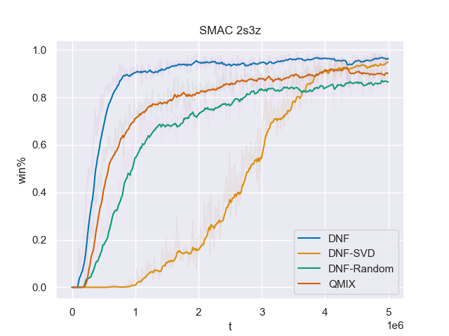

# 毕设论文《基于优先级划分的大规模多智能体强化学习决策方法研究》实验部分展示

## 目录
- [实验1-1](#实验1-1-dnf-qmix-qplex-hpnqmix在smacv1上的对比实验)
- [实验1-2](#实验1-2-dnf-dnf-random-dnf-svd-qmix在smacv1上的对比实验)

---

## 实验1-1 (DNF-QMIX-QPLEX-HPNQMIX在SMACv1上的对比实验)

### 实验环境
基准环境为 **[SMACv1](https://github.com/oxwhirl/smac)**（星际争霸多智能体挑战环境）：  


---

### 算法框架对比
| 算法名称       | 框架图                                                                               | 参考文献                                              |
|----------------|-----------------------------------------------------------------------------------|---------------------------------------------------|
| **QMIX**       |      | [论文链接](https://arxiv.org/abs/1803.11485)          |
| **QPLEX**      |     | [论文链接](https://arxiv.org/pdf/2008.01062)          |
| **HPN-QMIX**   |  | [论文链接](https://openreview.net/pdf?id=OxNQXyZK-K8) |
| **DNF**        |                                                          | 待更新                                               |

---

### 实验结果
#### 多场景对比（SMACv1）
|    |  |  |
|-------------------------------------|--------------------------------|--------------------------------|
|  |  |  |
|  |  |  |

---

### 实验启动方法

```bash
CUDA_VISIBLE_DEVICES="0" nohup python src/main.py --config={algo_name} --env-config=sc2 with env_args.map_name={map_name} obs_agent_id=True obs_last_action=False runner=parallel batch_size_run={parallel_num} buffer_size=5000 t_max={t_max} epsilon_anneal_time=100000 batch_size=128 td_lambda=0.6
```

---

## 实验1-2 (DNF-DNF-Random-DNF-SVD-QMIX在SMACv1上的对比实验)

### 实验结果
|    |  |  |
|-------------------------------------|--------------------------------|--------------------------------|
|  |  |  |

---

## 实验2-1 (DNF-DNF-Random-DNF-SVD-QMIX在SMACv1自定义地图上的对比实验)

### 实验结果
| 场景名称         | 算法对比图                    |
|--------------|--------------------------|
| **50m**      |  |

### 实验启动方法

```bash
# 50m run on same configs
CUDA_VISIBLE_DEVICES="0" nohup python src/main.py --config=qmix --env-config=sc2 with env_args.map_name=50m obs_agent_id=True obs_last_action=False runner=parallel batch_size_run=2 buffer_size=5000 t_max=1000000 epsilon_anneal_time=100000 batch_size=128 td_lambda=0.6 > 50m_QPLEX.out &

CUDA_VISIBLE_DEVICES="0" nohup python src/main.py --config=qplex --env-config=sc2 with env_args.map_name=50m obs_agent_id=True obs_last_action=False runner=parallel batch_size_run=2 buffer_size=5000 t_max=1000000 epsilon_anneal_time=100000 batch_size=128 td_lambda=0.6 > 50m_QPLEX.out &

CUDA_VISIBLE_DEVICES="0" nohup python src/main.py --config=hpn_qmix --env-config=sc2 with env_args.map_name=50m obs_agent_id=True obs_last_action=False runner=parallel batch_size_run=2 buffer_size=5000 t_max=1000000 epsilon_anneal_time=100000 batch_size=128 td_lambda=0.6 > 50m_HPN_QMIX.out &

CUDA_VISIBLE_DEVICES="0" nohup python src/main.py --config=dnf --env-config=sc2 with env_args.map_name=50m obs_agent_id=True obs_last_action=False runner=parallel batch_size_run=2 buffer_size=5000 t_max=1000000 epsilon_anneal_time=100000 batch_size=128 td_lambda=0.6 core_extractor_type=nn core_agent_ratio=0.7 > 50m_DNF.out &
```